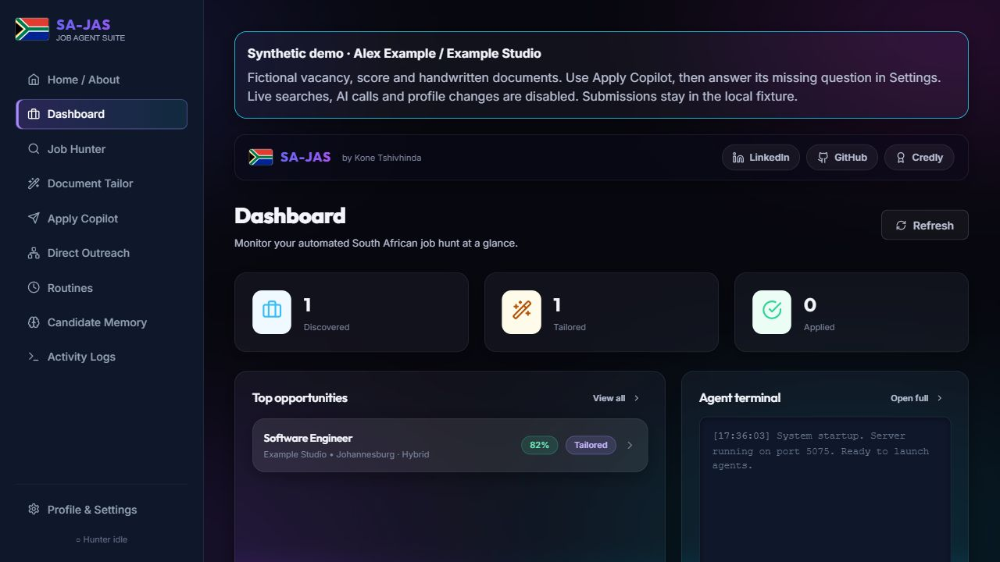
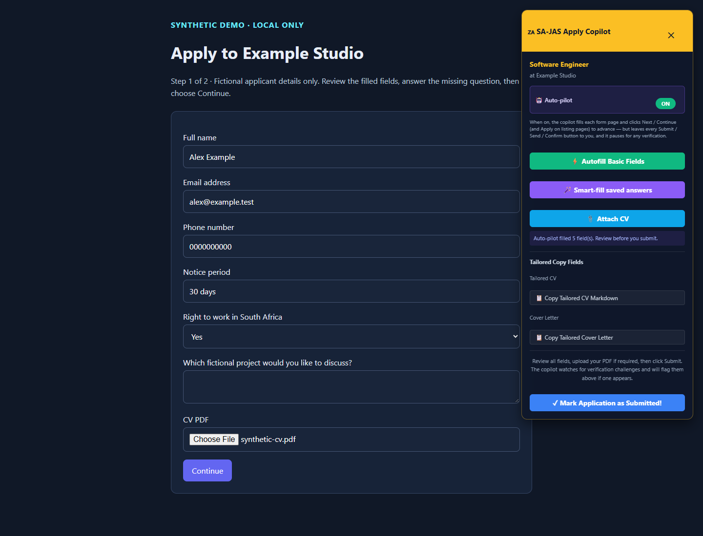
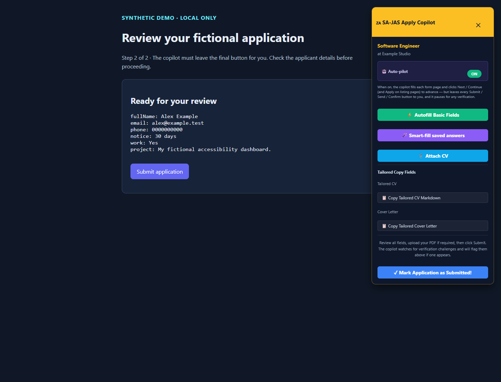
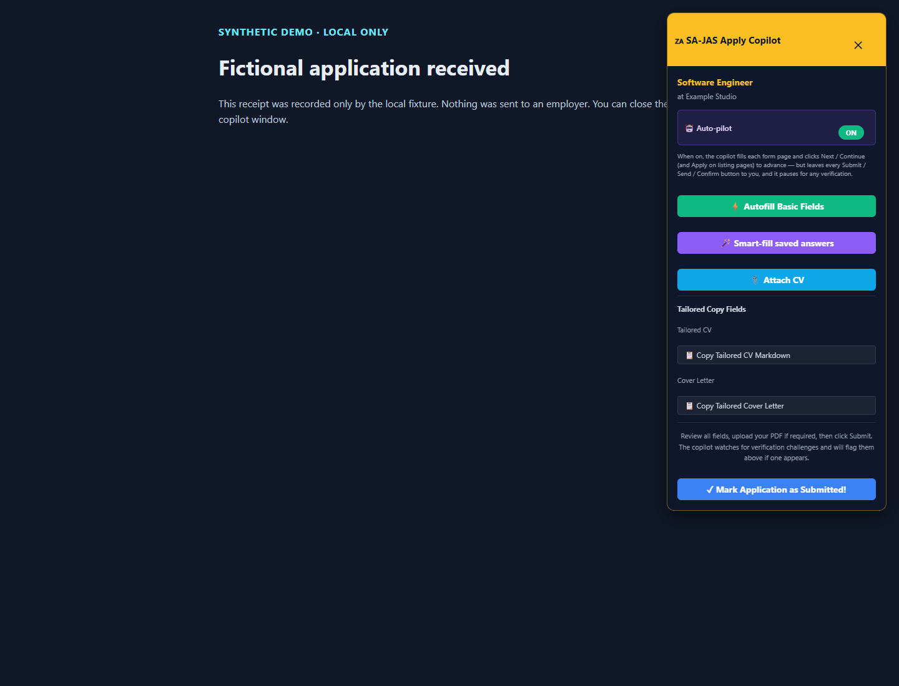
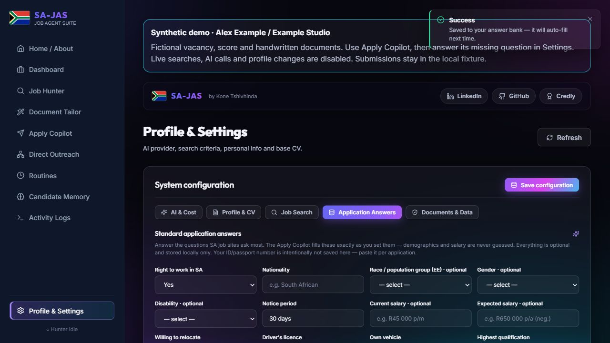

# A repeatable SA-JAS application walkthrough

This demonstration uses **Alex Example**, a fictional applicant, and **Example
Studio**, a fictional employer. The vacancy, 82% match score, CV and letter are
handwritten fixtures. No live vacancies are discovered and no AI text is generated.

The real dashboard, HTTP API, answer manager and browser copilot run against a
new temporary database. The copilot follows a local vacancy to an application
form, fills declared/saved answers, attaches a valid fictional CV PDF, captures
a missing question and leaves the final submission to the human. A local receipt
then exercises confirmation recording and candidate memory.

## Start from a clean checkout

Use Node 22.12 or newer (CI checks Node 22 and 24), npm, and Chrome or Playwright
Chromium. Run these commands from `sa-job-agent-suite/`:

```sh
npm ci --ignore-scripts
npx playwright install chromium
npm run demo
```

Open **http://127.0.0.1:4175**. The API and fictional portal listen on
**http://127.0.0.1:5075**. Both ports must be available; startup fails if another
service occupies them. Chrome is preferred when installed; Chromium is the
fallback. This walkthrough runs the React/Express app in a browser; packaged
Electron startup has its own CI check.

Every launch creates an OS temporary directory whose name starts with
`sajas-synthetic-`. Its database, empty key store, fresh browser profile and CV PDF
are independent of development files and Electron user data. Ctrl+C closes the
fixture browser and servers, then removes that temporary directory. A forced
process kill may leave disposable files behind; their path is printed at startup.
Restarting starts a fresh walkthrough.

## Walk through the application

1. **Dashboard.** See the synthetic banner, one prepared fictional vacancy and
   zero applied jobs. The number and match score are fixture values.
2. **Document Tailor.** Choose Software Engineer and inspect the handwritten CV
   and cover letter. The live tailoring controls are disabled by the demo API.
3. **Apply Copilot.** Choose **Launch copilot** for Software Engineer. A separate,
   visible browser opens the local vacancy and follows **Apply now**. The HUD
   persists when it reaches the form. Saved fictional contact answers fill the
   name, email and phone; declared profile answers fill notice period and right
   to work. The copilot attaches `synthetic-cv.pdf`.
4. **Answer the missing question.** The project question stays blank because no
   answer was declared. Turn the HUD's Auto-pilot **OFF** while reviewing. In the
   dashboard, open **Profile & Settings → Application Answers**. Answer “Which
   fictional project would you like to discuss?” with:
   **My fictional accessibility dashboard.** Choose **Save**. If needed, use
   **Refresh** to reload the pending-question list.
5. **Reuse the saved answer.** Return to the fixture browser and choose
   **Smart-fill saved answers**. Confirm that the project answer appears and the
   name and email remain correct. Choose **Continue** to open the review page.
6. **Inspect the final guard.** Turn Auto-pilot **ON** on the review page and wait
   at least a few seconds. It leaves **Submit application** untouched. The local
   counter at http://127.0.0.1:5075/api/demo still reports `submissions: 0`.
7. **Record the fictional receipt yourself.** Choose **Submit application** on
   the fixture page. This increments only the in-memory local fixture counter.
   The copilot recognizes the local receipt, saves its confirmation screenshot,
   records an applied job and adds its screening transcript to **Candidate Memory**.
   Refresh the dashboard to see the result. No employer receives an application.
8. **Stop.** Close the demo with Ctrl+C in the terminal. The new database, key
   store, browser profile and generated documents are removed.

The demo API uses an allowlist: live hunting, link checks, AI tailoring,
referrals, login setup, routines, profile/key changes and backup restoration are
blocked. AI calls are explicitly refused and the scheduler is not started. The
copilot browser blocks requests outside this fixture's exact origin. Optional
creator links on the dashboard remain ordinary external links; leave them
closed when keeping the walkthrough entirely local.

## Screenshots of verified behavior

The dashboard and saved-answer images come from manual browser checks. The form, review and
receipt images come from the regression driving the real copilot against the
same local pages; its browser is headless for CI. All depicted applicant details
and employer records are fictional.











## Repeat the verification

```sh
npm test --workspace=server
npm run test:demo
npm run build:client
```

The dedicated demo regression has nine workflow checks (ten Node test results
including the parent scenario). It verifies fresh fictional data, empty keys,
blocked live API actions and AI entry points, actual browser navigation and PDF
attachment, capture/answer/reuse of a required question, retained name/email on
the second fill, no automatic final submission, browser origin confinement,
explicit fixture submission, confirmation evidence, candidate memory, zero AI
usage and temporary-data cleanup. Missing browsers fail this regression rather
than skip it. CI installs Chromium and runs it on Node 24.

The repeat-fill check caught and now covers an existing defect: old
`data-sajas-fid` tags could cause the next pass to overwrite an already-filled
name/email field. Tags are now cleared before each new field snapshot.

To regenerate the three copilot screenshots, set `SAJAS_DEMO_EVIDENCE_DIR` to an
output directory before `npm run test:demo`. For example, in PowerShell from
`sa-job-agent-suite/`:

```powershell
$env:SAJAS_DEMO_EVIDENCE_DIR = (Join-Path (Get-Location) '..\docs\screenshots')
npm run test:demo
```

These results establish behavior on controlled local fixtures. Real job-site
compatibility, CAPTCHA handoffs on live sites, paid provider/model behavior,
live CV generation and successful employer delivery need separate evidence.
